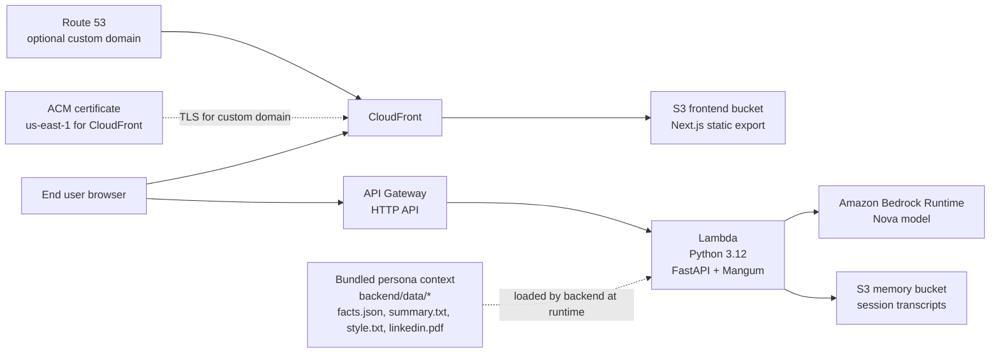

# Prop Assist Twin

Technical README for running and deploying the project.

`prop-assist-twin` is a full-stack real-estate assistant PoC built as a digital twin experience. The frontend is a static Next.js application, the backend is a FastAPI service adapted to AWS Lambda with Mangum, and the inference layer is Amazon Bedrock with Nova models. Conversation state can be stored locally during development or in S3 in AWS deployments.

---

## Architecture



### AWS components

- **S3 (frontend bucket)** serves the statically exported Next.js app.
- **CloudFront** sits in front of the S3 website endpoint.
- **API Gateway HTTP API** exposes the backend endpoints.
- **Lambda** runs the FastAPI application through Mangum.
- **Amazon Bedrock Runtime** handles inference using the configured Nova model.
- **S3 (memory bucket)** stores conversation history in deployed environments.
- **Route 53 + ACM** are optional and only used when a custom domain is enabled.

---

## Repository layout

```text
.
├── backend/
│   ├── data/
│   ├── context.py
│   ├── deploy.py
│   ├── lambda_handler.py
│   ├── pyproject.toml
│   ├── requirements.txt
│   ├── resources.py
│   └── server.py
├── frontend/
│   ├── app/
│   ├── components/
│   ├── public/
│   ├── next.config.ts
│   └── package.json
├── scripts/
│   ├── deploy.sh
│   └── destroy.sh
├── terraform/
│   ├── backend.tf
│   ├── main.tf
│   ├── outputs.tf
│   ├── terraform.tfvars
│   ├── variables.tf
│   └── versions.tf
└── .github/workflows/deploy.yml
```

---

## Tech stack

### Frontend
- Next.js 16
- React 19
- TypeScript 5
- Tailwind CSS 4
- Lucide React

### Backend
- Python 3.12
- FastAPI
- Mangum
- Boto3
- PyPDF
- python-dotenv
- Uvicorn

### AWS / Infra
- AWS Lambda
- API Gateway HTTP API
- Amazon Bedrock Runtime
- S3
- CloudFront
- Route 53 (optional)
- ACM (optional, for custom domain)
- Terraform
- GitHub Actions
- Docker (used to build the Lambda deployment package)

---

## Prerequisites

Install the following before running the project:

- **Node.js 20+**
- **npm**
- **Python 3.12**
- **Docker**
- **Terraform >= 1.0**
- **AWS CLI** configured with credentials that can access Bedrock and deploy infrastructure
- **uv** (recommended and expected by `scripts/deploy.sh`)

You also need **Amazon Bedrock model access** in the target AWS account and region.

---

## Local development

### 1) Start the backend

From the repository root:

```bash
cd backend
python3.12 -m venv .venv
source .venv/bin/activate
pip install -r requirements.txt
```

Set local environment variables:

```bash
export DEFAULT_AWS_REGION=eu-central-1
export BEDROCK_MODEL_ID=eu.amazon.nova-lite-v1:0
export CORS_ORIGINS=http://localhost:3000
export USE_S3=false
export MEMORY_DIR=../memory
```

Run the API:

```bash
uvicorn server:app --reload --host 0.0.0.0 --port 8000
```

### Backend notes

- The backend loads persona/context files from `backend/data/`.
- Local execution still requires valid AWS credentials because inference is performed against Amazon Bedrock from your machine.
- `summary.txt`, `style.txt`, and `facts.json` are required.
- `linkedin.pdf` is optional; if it is missing, the backend falls back to `"LinkedIn profile not available"`.
- Local memory is stored as JSON files when `USE_S3=false`.

---

### 2) Start the frontend

In a second terminal:

```bash
cd frontend
npm install
printf "NEXT_PUBLIC_API_URL=http://localhost:8000\n" > .env.local
npm run dev
```

Open:

```text
http://localhost:3000
```

---

### 3) Smoke test the backend

Health check:

```bash
curl http://localhost:8000/health
```

Chat request:

```bash
curl -X POST http://localhost:8000/chat \
  -H "Content-Type: application/json" \
  -d '{
    "message": "Hallo, wer bist du?",
    "session_id": "demo-session"
  }'
```

Conversation history:

```bash
curl http://localhost:8000/conversation/demo-session
```

---

## Environment variables

### Backend

| Variable | Required | Default | Purpose |
|---|---:|---|---|
| `DEFAULT_AWS_REGION` | yes | `eu-central-1` | Region used by the Bedrock runtime client |
| `BEDROCK_MODEL_ID` | yes | `eu.amazon.nova-lite-v1:0` locally | Bedrock model to invoke |
| `CORS_ORIGINS` | yes | `http://localhost:3000` | Allowed browser origins |
| `USE_S3` | no | `false` | Enables S3-backed conversation storage |
| `S3_BUCKET` | only if `USE_S3=true` | empty | Bucket for session memory |
| `MEMORY_DIR` | only if `USE_S3=false` | `../memory` | Local directory for chat history |

### Frontend

| Variable | Required | Purpose |
|---|---:|---|
| `NEXT_PUBLIC_API_URL` | yes | Base URL of the backend API |

### Important model default mismatch

There is a repo-level mismatch between local and deployed defaults:

- `backend/server.py` defaults to `eu.amazon.nova-lite-v1:0`
- Terraform defaults to `eu.amazon.nova-micro-v1:0`

Set `BEDROCK_MODEL_ID` explicitly in every environment if you want the same model everywhere.

---

## Manual AWS deployment

### 1) One-time bootstrap for the Terraform remote state backend

The deployment script expects an **existing** S3 bucket for Terraform state and an **existing** DynamoDB table for state locking.

```bash
export AWS_ACCOUNT_ID=$(aws sts get-caller-identity --query Account --output text)
export AWS_REGION=${DEFAULT_AWS_REGION:-eu-central-1}

aws s3api create-bucket \
  --bucket twin-terraform-state-${AWS_ACCOUNT_ID} \
  --region ${AWS_REGION} \
  --create-bucket-configuration LocationConstraint=${AWS_REGION}

aws dynamodb create-table \
  --table-name twin-terraform-locks \
  --attribute-definitions AttributeName=LockID,AttributeType=S \
  --key-schema AttributeName=LockID,KeyType=HASH \
  --billing-mode PAY_PER_REQUEST \
  --region ${AWS_REGION}
```

> If the bucket or table already exists, skip this step.

---

### 2) Configure Terraform variables

Edit `terraform/terraform.tfvars` as needed:

```hcl
project_name = "prop-assist-twin"
environment = "dev"
bedrock_model_id = "eu.amazon.nova-micro-v1:0"
lambda_timeout = 60
api_throttle_burst_limit = 10
api_throttle_rate_limit = 5
use_custom_domain = false
root_domain = ""
```

### Custom domain

To enable a custom domain:

```hcl
use_custom_domain = true
root_domain       = "example.com"
```

Requirements:

- Public Route 53 hosted zone for the apex domain
- ACM certificate validation in **us-east-1** for CloudFront

---

### 3) Deploy

Make sure AWS credentials are already available in your shell.

From the repository root:

```bash
chmod +x scripts/deploy.sh
./scripts/deploy.sh dev prop-assist-twin
```

> `scripts/deploy.sh` defaults the resource prefix to `twin` when the second argument is omitted. Pass `prop-assist-twin` explicitly if you want the deployed resource names to match the repository name.

The deployment script performs the following:

1. Builds the Lambda package in `backend/lambda-deployment.zip` using Docker and the AWS Lambda Python 3.12 base image.
2. Initializes Terraform with the S3 backend and selects or creates the workspace.
3. Applies the infrastructure.
4. Writes `frontend/.env.production` with the deployed API Gateway URL.
5. Builds the frontend and syncs the static export in `frontend/out` to the S3 frontend bucket.

---

### 4) Destroy

```bash
export DEFAULT_AWS_REGION=eu-central-1
chmod +x scripts/destroy.sh
./scripts/destroy.sh dev prop-assist-twin
```

> `scripts/destroy.sh` defaults the region to `us-east-1` when `DEFAULT_AWS_REGION` is unset, so exporting the deployment region explicitly is recommended.

The destroy script empties the frontend and memory buckets before running `terraform destroy`.

---

## CI/CD

GitHub Actions deployment is defined in:

```text
.github/workflows/deploy.yml
```

It runs on:

- push to `main`
- manual `workflow_dispatch`

Required GitHub secrets:

- `AWS_ROLE_ARN`
- `AWS_ACCOUNT_ID`
- `DEFAULT_AWS_REGION`

The workflow:

1. Checks out the repository
2. Assumes the AWS role
3. Installs Python 3.12, Node 20, Terraform, and `uv`
4. Executes `scripts/deploy.sh`
5. Reads Terraform outputs
6. Invalidates CloudFront

> The current workflow calls `scripts/deploy.sh` without the optional project-name argument, so the default resource prefix is `twin` unless the workflow is adjusted.

---

## API endpoints

### `GET /`
Returns a service descriptor with memory/storage/model metadata.

### `GET /health`
Returns a simple health payload.

### `POST /chat`
Accepts:

```json
{
  "message": "Hallo",
  "session_id": "optional-session-id"
}
```

Returns:

```json
{
  "response": "...",
  "session_id": "..."
}
```

### `GET /conversation/{session_id}`
Implemented in FastAPI for local use, but **not currently exposed by the Terraform-managed API Gateway routes**.

If you want this endpoint available in AWS, add a matching `GET /conversation/{session_id}` route in `terraform/main.tf`.

---

## Troubleshooting

### Bedrock access denied
- Confirm the AWS principal has Bedrock access.
- Confirm the selected Nova model is enabled in the target region.

### Frontend cannot call the API
- Check `NEXT_PUBLIC_API_URL`.
- Check `CORS_ORIGINS` on the backend.

### Lambda package build fails
- Docker is required because the deployment package is built against the Lambda Python 3.12 runtime image.

### Terraform init fails
- Confirm the remote state bucket and DynamoDB lock table already exist.
- Confirm the AWS credentials point to the correct account.

### Custom domain does not come up
- Confirm `use_custom_domain=true` and `root_domain` is set.
- Confirm the hosted zone exists in Route 53.
- Confirm ACM validation completed in `us-east-1`.

---

## Implementation notes

- The frontend uses `output: "export"`, so the production site is a **static export** rather than a server-rendered Next.js deployment.
- The browser calls API Gateway directly; CloudFront is only in front of the static frontend bucket.
- Lambda stores session memory in S3 when `USE_S3=true`; otherwise it uses local JSON files.
- Persona grounding is assembled from structured text files plus a LinkedIn PDF extracted with PyPDF.
