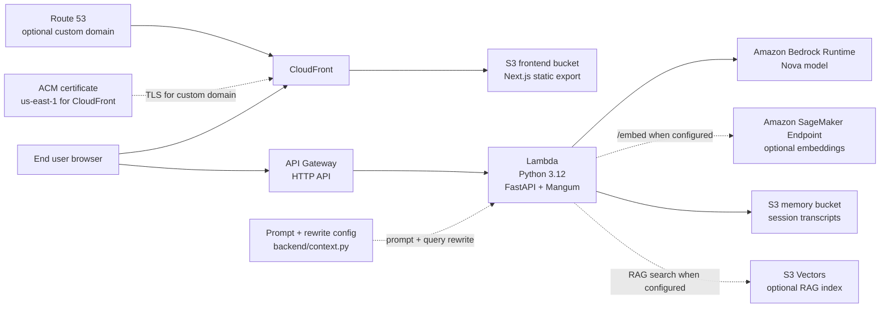

# Prop Assist Twin

Technical README for running and deploying the project.

`prop-assist-twin` is a full-stack real-estate assistant PoC built as a digital twin experience. The frontend is a static Next.js application, the backend is a FastAPI service adapted to AWS Lambda with Mangum, and the inference layer is Amazon Bedrock with Nova models. Conversation state can be stored locally during development or in S3 in AWS deployments. The backend also includes an optional SageMaker-based embedding path exposed via `/embed`, S3 Vectors-backed RAG retrieval for `/chat`, and a markdown ingestion route exposed via `/ingest`.

* * *

## Architecture



### AWS components

  * S3 (frontend bucket) serves the statically exported Next.js app.
  * CloudFront sits in front of the S3 website endpoint.
  * API Gateway HTTP API exposes the backend endpoints.
  * Lambda runs the FastAPI application through Mangum.
  * Amazon Bedrock Runtime handles inference using the configured Nova model.
  * Amazon SageMaker can optionally host a serverless embedding endpoint used by `/embed` and RAG ingestion/retrieval.
  * S3 (memory bucket) stores conversation history in deployed environments.
  * S3 Vectors can optionally store indexed markdown chunks for RAG-backed `/chat` answers.
  * Route 53 + ACM are optional and only used when a custom domain is enabled.

> `backend/server.py` now exposes `/ingest` for markdown ingestion and uses S3 Vectors-backed retrieval inside `/chat` when RAG is configured. Terraform can provision an S3 Vectors bucket and index and pass their names to Lambda as `VECTOR_BUCKET` and `VECTOR_INDEX` when `s3vectors_enabled = true`.

* * *

## Repository layout

```text
.
├── backend/
│   ├── data/
│   │   ├── facts.json
│   │   ├── linkedin.pdf
│   │   ├── style.txt
│   │   └── summary.txt
│   ├── .python-version
│   ├── context.py
│   ├── deploy.py
│   ├── index-kb.py
│   ├── lambda_handler.py
│   ├── me.txt
│   ├── pyproject.toml
│   ├── requirements.txt
│   ├── resources.py
│   ├── server.py
│   └── uv.lock
├── frontend/
│   ├── app/
│   │   ├── globals.css
│   │   ├── layout.tsx
│   │   └── page.tsx
│   ├── components/
│   │   └── twin.tsx
│   ├── public/
│   ├── README.md
│   ├── eslint.config.mjs
│   ├── next.config.ts
│   ├── package-lock.json
│   ├── package.json
│   ├── postcss.config.mjs
│   └── tsconfig.json
├── scripts/
│   ├── deploy.sh
│   └── destroy.sh
├── terraform/
│   ├── backend.tf
│   ├── main.tf
│   ├── outputs.tf
│   ├── terraform.tfvars
│   ├── variables.tf
│   └── versions.tf
└── .github/workflows/deploy.yml
```

* * *

## Tech stack

### Frontend

  * Next.js 16
  * React 19
  * TypeScript 5
  * Tailwind CSS 4
  * Lucide React

### Backend

  * Python 3.12
  * FastAPI
  * Mangum
  * Boto3
  * PyPDF
  * python-dotenv
  * python-multipart
  * Uvicorn
  * SageMaker Runtime client for optional embeddings
  * Bedrock light-model query rewriting for RAG
  * Amazon S3 Vectors client support for RAG ingestion and retrieval

### AWS / Infra

  * AWS Lambda
  * API Gateway HTTP API
  * Amazon Bedrock Runtime
  * Amazon SageMaker endpoint (optional, for embeddings)
  * S3
  * CloudFront
  * Route 53 (optional)
  * ACM (optional, for custom domain)
  * Terraform
  * GitHub Actions
  * Docker (used to build the Lambda deployment package)

* * *

## Prerequisites

Install the following before running the project:

  * Node.js 20+
  * npm
  * Python 3.12
  * Docker
  * Terraform >= 1.0
  * AWS CLI configured with credentials that can access Bedrock and deploy infrastructure
  * uv (recommended and expected by `scripts/deploy.sh`)

You also need Amazon Bedrock model access in the target AWS account and region.

If you want to use embeddings, you also need:

  * permission to create and invoke SageMaker endpoints
  * enough SageMaker serverless quota in the target region
  * a valid region-specific Hugging Face inference image URI

* * *

## Local development

### 1) Start the backend

From the repository root:

```bash
cd backend
python3.12 -m venv .venv
source .venv/bin/activate
pip install -r requirements.txt
```

Set local environment variables:

```bash
export DEFAULT_AWS_REGION=eu-central-1
export BEDROCK_MODEL_ID=eu.amazon.nova-pro-v1:0
export BEDROCK_LIGHT_MODEL_ID=eu.amazon.nova-micro-v1:0
export CORS_ORIGINS=http://localhost:3000
export USE_S3=false
export MEMORY_DIR=../memory

# optional: enable /embed locally by pointing at an existing SageMaker endpoint
export SAGEMAKER_ENDPOINT=""

# optional: enable RAG retrieval and markdown ingestion when the embedding endpoint and S3 Vectors are configured
export RAG_ENABLED=true
export VECTOR_BUCKET=""
export VECTOR_INDEX=""
export RETRIEVAL_TOP_K=3
export LOG_LEVEL=INFO
export MAX_RETRIEVAL_DISTANCE=""
export SOURCE_SNIPPET_CHARS=280
export CHUNK_SIZE=1500
export CHUNK_OVERLAP=200
export RAW_FETCH_SIZE=12
export FINAL_TOP_K=3
export MAX_CHUNKS_PER_DOC=2
```

Run the API:

```bash
uvicorn server:app --reload --host 0.0.0.0 --port 8000
```

### Backend notes

  * The active prompt and query-rewrite prompt are defined in `backend/context.py`.
  * `backend/data/` and `resources.py` are still present in the repo, but the current `server.py` runtime path imports prompt logic from `context.py`.
  * Local execution still requires valid AWS credentials because inference is performed against Amazon Bedrock from your machine.
  * Local memory is stored as JSON files when `USE_S3=false`.
  * `/embed` returns an error unless `SAGEMAKER_ENDPOINT` is configured.
  * RAG for `/chat` is active only when `RAG_ENABLED=true` and `SAGEMAKER_ENDPOINT`, `VECTOR_BUCKET`, and `VECTOR_INDEX` are configured.
  * `/chat` can rewrite follow-up questions with `BEDROCK_LIGHT_MODEL_ID` before retrieval.
  * `/ingest` accepts markdown files, chunks the content, generates embeddings, and writes chunks to S3 Vectors.

* * *

### 2) Start the frontend

In a second terminal:

```bash
cd frontend
npm install
printf "NEXT_PUBLIC_API_URL=http://localhost:8000\n" > .env.local
npm run dev
```

Open:

```text
http://localhost:3000
```

* * *

### 3) Smoke test the backend

Health check:

```bash
curl http://localhost:8000/health
```

Chat request:

```bash
curl -X POST http://localhost:8000/chat \
  -H "Content-Type: application/json" \
  -d '{
    "message": "Hallo, wer bist du?",
    "session_id": "demo-session"
  }'
```

Conversation history:

```bash
curl http://localhost:8000/conversation/demo-session
```

Embedding request (only works when `SAGEMAKER_ENDPOINT` is configured):

```bash
curl -X POST http://localhost:8000/embed \
  -H "Content-Type: application/json" \
  -d '{
    "text": "3 Zimmer Wohnung in Berlin mit Balkon"
  }'
```

Markdown ingestion request (only works when RAG dependencies are configured):

```bash
curl -X POST http://localhost:8000/ingest \
  -F "file=@docs/sample.md"
```

* * *

## Environment variables

### Backend

| Variable | Required | Default | Purpose |
|---|---:|---|---|
| `DEFAULT_AWS_REGION` | yes | `eu-central-1` | Region used by the Bedrock, SageMaker Runtime, and S3 Vectors clients |
| `BEDROCK_MODEL_ID` | yes | `eu.amazon.nova-pro-v1:0` locally | Bedrock model to invoke for final answers |
| `BEDROCK_LIGHT_MODEL_ID` | no | `eu.amazon.nova-micro-v1:0` | Bedrock model used for query rewriting before retrieval |
| `CORS_ORIGINS` | yes | `http://localhost:3000` | Allowed browser origins |
| `USE_S3` | no | `false` | Enables S3-backed conversation storage |
| `S3_BUCKET` | only if `USE_S3=true` | empty | Bucket for session memory |
| `MEMORY_DIR` | only if `USE_S3=false` | `../memory` | Local directory for chat history |
| `SAGEMAKER_ENDPOINT` | only for `/embed`, `/ingest`, or RAG | empty | SageMaker endpoint name used to generate embeddings |
| `VECTOR_BUCKET` | only for `/ingest` or RAG | empty | S3 Vectors bucket name used by ingestion and retrieval |
| `VECTOR_INDEX` | only for `/ingest` or RAG | empty | S3 Vectors index name used by ingestion and retrieval |
| `RAG_ENABLED` | no | `true` | Enables retrieval inside `/chat` when vector dependencies are configured |
| `RETRIEVAL_TOP_K` | no | `3` | Number of source chunks returned to the model after reranking |
| `LOG_LEVEL` | no | `INFO` | Backend logging level |
| `MAX_RETRIEVAL_DISTANCE` | no | empty | Optional S3 Vectors distance cutoff; empty disables the cutoff |
| `SOURCE_SNIPPET_CHARS` | no | `280` | Maximum snippet length included for each returned source |
| `CHUNK_SIZE` | no | `1500` | Approximate ingestion chunk size in characters |
| `CHUNK_OVERLAP` | no | `200` | Character overlap between ingestion chunks |
| `RAW_FETCH_SIZE` | no | `12` | Number of raw vector matches fetched before reranking |
| `FINAL_TOP_K` | no | `3` | Maximum number of final source chunks passed to the answer model |
| `MAX_CHUNKS_PER_DOC` | no | `2` | Per-document cap applied during retrieval source selection |

### Frontend

| Variable | Required | Purpose |
|---|---:|---|
| `NEXT_PUBLIC_API_URL` | yes | Base URL of the backend API |

### Important repo mismatches and caveats

There are a few repo-level mismatches worth knowing about:

  * `backend/server.py` defaults to `eu.amazon.nova-pro-v1:0` for final answers and `eu.amazon.nova-micro-v1:0` for query rewriting.
  * Terraform variable defaults also use `eu.amazon.nova-pro-v1:0` for `bedrock_model_id` and `eu.amazon.nova-micro-v1:0` for `bedrock_light_model_id`.
  * The checked-in `terraform/terraform.tfvars` file overrides `bedrock_model_id` to `eu.amazon.nova-micro-v1:0`.
  * The checked-in `terraform/terraform.tfvars` file enables SageMaker embeddings and S3 Vectors by default. The current Terraform code declares the matching S3 Vectors variables, provisions the vector bucket and index when `s3vectors_enabled = true`, and passes their names to Lambda as `VECTOR_BUCKET` and `VECTOR_INDEX`.
  * `RAW_FETCH_SIZE`, `FINAL_TOP_K`, and `MAX_CHUNKS_PER_DOC` are available in backend code but are not currently wired as Terraform variables.

Set `BEDROCK_MODEL_ID` explicitly in every environment if you want the same model everywhere.

* * *

## Manual AWS deployment

### 1) One-time bootstrap for the Terraform remote state backend

The deployment script expects an existing S3 bucket for Terraform state and an existing DynamoDB table for state locking.

```bash
export AWS_ACCOUNT_ID=$(aws sts get-caller-identity --query Account --output text)
export AWS_REGION=${DEFAULT_AWS_REGION:-eu-central-1}
aws s3api create-bucket \
  --bucket twin-terraform-state-${AWS_ACCOUNT_ID} \
  --region ${AWS_REGION} \
  --create-bucket-configuration LocationConstraint=${AWS_REGION}

aws dynamodb create-table \
  --table-name twin-terraform-locks \
  --attribute-definitions AttributeName=LockID,AttributeType=S \
  --key-schema AttributeName=LockID,KeyType=HASH \
  --billing-mode PAY_PER_REQUEST \
  --region ${AWS_REGION}
```

> If the bucket or table already exists, skip this step.

* * *

### 2) Configure Terraform variables

Edit `terraform/terraform.tfvars` as needed:

```hcl
project_name = "prop-assist-twin"
environment = "dev"
bedrock_model_id = "eu.amazon.nova-micro-v1:0"
bedrock_light_model_id = "eu.amazon.nova-micro-v1:0"
lambda_timeout = 60
api_throttle_burst_limit = 10
api_throttle_rate_limit = 5
use_custom_domain = false
root_domain = ""

# optional embeddings
sagemaker_embedding_enabled = true
sagemaker_embedding_model_name = "sentence-transformers/all-MiniLM-L6-v2"
sagemaker_embedding_image_uri = "763104351884.dkr.ecr.eu-central-1.amazonaws.com/huggingface-pytorch-inference:1.13.1-transformers4.26.0-cpu-py39-ubuntu20.04"
sagemaker_embedding_serverless_memory_mb = 3072
sagemaker_embedding_max_concurrency = 2

# optional RAG tuning
rag_enabled = true
retrieval_top_k = 3
log_level = "INFO"
max_retrieval_distance = 0.5
source_snippet_chars = 280
chunk_size = 1500
chunk_overlap = 200
```

### Embeddings

To disable embeddings entirely:

```hcl
sagemaker_embedding_enabled = false
sagemaker_embedding_image_uri = ""
```

> **Production note:** `./scripts/deploy.sh prod <project-name>` runs `terraform apply -var-file=prod.tfvars ...` from the `terraform/` directory. Create `terraform/prod.tfvars` before running a production deployment.

Notes:

  * `sagemaker_embedding_image_uri` is region-specific; the checked-in example is for `eu-central-1`.
  * When embeddings are enabled, Terraform provisions a serverless SageMaker endpoint and passes its name to Lambda as `SAGEMAKER_ENDPOINT`.
  * S3 Vectors is configured separately; see the optional S3 Vectors section below.

### S3 Vectors (optional)

To enable S3 Vectors-backed helper functions in Lambda, add the following Terraform variables:

```hcl
s3vectors_enabled = true
s3vectors_index_name = "property-kb"
s3vectors_dimension = 384
s3vectors_distance_metric = "cosine"
s3vectors_non_filterable_metadata_keys = ["chunk_text"]
```

Notes:

  * Terraform provisions the S3 Vectors bucket and index when `s3vectors_enabled = true`.
  * Lambda receives the provisioned names as `VECTOR_BUCKET` and `VECTOR_INDEX`.
  * The backend uses these values for `/ingest`, `/chat` RAG retrieval, internal helper functions, and the `/health` payload.
  * The repo exposes markdown ingestion through `/ingest`; vector search itself remains part of the `/chat` flow rather than a separate public query route.

### Custom domain

To enable a custom domain:

```hcl
use_custom_domain = true
root_domain       = "example.com"
```

Requirements:

  * Public Route 53 hosted zone for the apex domain
  * ACM certificate validation in `us-east-1` for CloudFront

* * *

### 3) Deploy

Make sure AWS credentials are already available in your shell.

From the repository root:

```bash
chmod +x scripts/deploy.sh
./scripts/deploy.sh dev prop-assist-twin
```

> `scripts/deploy.sh` defaults the resource prefix to `twin` when the second argument is omitted. Pass `prop-assist-twin` explicitly if you want the deployed resource names to match the repository name.

The deployment script performs the following:

  1. Builds the Lambda package in `backend/lambda-deployment.zip` using Docker and the AWS Lambda Python 3.12 base image.
  2. Initializes Terraform with the S3 backend and selects or creates the workspace.
  3. Applies the infrastructure.
  4. Writes `frontend/.env.production` with the deployed API Gateway URL.
  5. Builds the frontend and syncs the static export in `frontend/out` to the S3 frontend bucket.

* * *

### 4) Destroy

```bash
export DEFAULT_AWS_REGION=eu-central-1
chmod +x scripts/destroy.sh
./scripts/destroy.sh dev prop-assist-twin
```

> `scripts/destroy.sh` defaults the region to `us-east-1` when `DEFAULT_AWS_REGION` is unset, so exporting the deployment region explicitly is recommended.

The destroy script empties the frontend and memory buckets before running `terraform destroy`. If `backend/lambda-deployment.zip` does not exist, the script creates a dummy archive so destroy can still proceed.

* * *

## Terraform outputs

After a successful apply, useful outputs include:

  * `api_gateway_url`
  * `cloudfront_url`
  * `s3_frontend_bucket`
  * `s3_memory_bucket`
  * `lambda_function_name`
  * `custom_domain_url`
  * `sagemaker_embedding_endpoint_name`
  * `sagemaker_embedding_endpoint_arn`
  * `s3vectors_bucket_name`
  * `s3vectors_bucket_arn`
  * `s3vectors_index_name`
  * `s3vectors_index_arn`

* * *

## CI/CD

GitHub Actions deployment is defined in:

```text
.github/workflows/deploy.yml
```

It runs on:

  * push to `main`
  * manual `workflow_dispatch`

Required GitHub secrets:

  * `AWS_ROLE_ARN`
  * `DEFAULT_AWS_REGION`

Optional / currently redundant:

  * `AWS_ACCOUNT_ID` — the workflow exports this value, but the current deployment scripts derive the account ID with `aws sts get-caller-identity`.

The workflow:

  1. Checks out the repository.
  2. Assumes the AWS role.
  3. Installs Python 3.12, Node 20, Terraform, and `uv`.
  4. Installs backend dependencies and runs `pytest -q`.
  5. Executes `scripts/deploy.sh`.
  6. Reads Terraform outputs.
  7. Invalidates CloudFront.

> The current workflow calls `scripts/deploy.sh` without the optional project-name argument, so the default resource prefix is `twin` unless the workflow is adjusted.

> Because the workflow uses the checked-in Terraform files, it will also provision the SageMaker embedding endpoint whenever `terraform/terraform.tfvars` keeps `sagemaker_embedding_enabled = true`.

* * *

## API endpoints

### `GET /`

Returns a service descriptor with memory/storage/model metadata.

### `GET /health`

Returns a simple health payload including:

```json
{
  "status": "healthy",
  "use_s3": true,
  "bedrock_model": "...",
  "sagemaker_endpoint_configure": true,
  "s3vectors_configured": true,
  "rag_enabled": true
}
```

### `POST /chat`

Accepts:

```json
{
  "message": "Hallo",
  "session_id": "optional-session-id"
}
```

Returns:

```json
{
  "response": "...",
  "session_id": "...",
  "sources": [
    {
      "id": "...",
      "doc_id": "...",
      "title": "...",
      "snippet": "...",
      "distance": 0.123,
      "score": 0.456
    }
  ],
  "retrieval_used": true
}
```

When RAG is configured, `/chat` rewrites follow-up questions with the light Bedrock model, fetches candidate chunks from S3 Vectors, applies lexical reranking, and passes the selected source snippets to the final answer model.

### `POST /embed`

Accepts:

```json
{
  "text": "3 room apartment in Munich"
}
```

Returns:

```json
{
  "embedding": [0.123, -0.456, 0.789]
}
```

This route is exposed both locally and in the Terraform-managed API Gateway, but it only works when `SAGEMAKER_ENDPOINT` is configured.

### `POST /ingest`

Accepts multipart form upload of a markdown file:

```bash
curl -X POST http://localhost:8000/ingest \
  -F "file=@docs/sample.md"
```

Returns:

```json
{
  "filename": "sample.md",
  "chunks_indexed": 3,
  "status": "success"
}
```

This route is exposed both locally and in the Terraform-managed API Gateway. It only accepts `.md` files and requires `SAGEMAKER_ENDPOINT`, `VECTOR_BUCKET`, and `VECTOR_INDEX`.

### `GET /conversation/{session_id}`

Implemented in FastAPI for local use, but not currently exposed by the Terraform-managed API Gateway routes.

If you want this endpoint available in AWS, add a matching `GET /conversation/{session_id}` route in `terraform/main.tf`.

### Internal vector helpers

The backend currently defines:

  * `index_text_chunk(text, metadata=None, vector_id=None)`
  * `search_text_chunks(query, top_k=5)`

These use the S3 Vectors client and require `VECTOR_BUCKET` + `VECTOR_INDEX`. Terraform can provision those resources and pass the resulting names to Lambda when `s3vectors_enabled = true`. Public ingestion is handled by `/ingest`; vector search is used internally by `/chat` rather than exposed as a standalone public query route.

* * *

## Troubleshooting

### Bedrock access denied

  * Confirm the AWS principal has Bedrock access.
  * Confirm the selected Nova model is enabled in the target region.

### `/embed` returns `SAGEMAKER ENDPOINT not configured`

  * Set `SAGEMAKER_ENDPOINT` locally, or enable SageMaker embeddings in Terraform so Lambda receives it automatically.
  * Confirm the endpoint exists and is in the same region as `DEFAULT_AWS_REGION`.

### Embedding deployment fails

  * If `sagemaker_embedding_enabled=true`, `sagemaker_embedding_image_uri` must be valid for the target region.
  * Confirm your account has SageMaker permissions and enough serverless inference quota.

### `/ingest` returns an error

  * Confirm the uploaded file has a `.md` extension.
  * Confirm `SAGEMAKER_ENDPOINT`, `VECTOR_BUCKET`, and `VECTOR_INDEX` are configured.
  * Confirm the Lambda role or local AWS principal can invoke the SageMaker endpoint and write to S3 Vectors.

### RAG is not used by `/chat`

  * Confirm `RAG_ENABLED=true`.
  * Confirm the health payload reports `sagemaker_endpoint_configure=true` and `s3vectors_configured=true`.
  * Confirm markdown content has been indexed through `/ingest` or the indexing helper path.

### Frontend cannot call the API

  * Check `NEXT_PUBLIC_API_URL`.
  * Check `CORS_ORIGINS` on the backend.

### Lambda package build fails

  * Docker is required because the deployment package is built against the Lambda Python 3.12 runtime image.

### Terraform init fails

  * Confirm the remote state bucket and DynamoDB lock table already exist.
  * Confirm the AWS credentials point to the correct account.

### Expected vector search support, but health reports `s3vectors_configured=false`

  * `s3vectors_configured` only becomes true when both `VECTOR_BUCKET` and `VECTOR_INDEX` are set.
  * In Terraform-managed deployments, `VECTOR_BUCKET` and `VECTOR_INDEX` are populated automatically when `s3vectors_enabled = true`. `/ingest` and RAG-backed `/chat` still require the SageMaker embedding endpoint as well.

### Custom domain does not come up

  * Confirm `use_custom_domain=true` and `root_domain` is set.
  * Confirm the hosted zone exists in Route 53.
  * Confirm ACM validation completed in `us-east-1`.

* * *

## Implementation notes

  * The frontend uses `output: "export"`, so the production site is a static export rather than a server-rendered Next.js deployment.
  * `next.config.ts` also sets `images.unoptimized = true` for static export compatibility.
  * The browser calls API Gateway directly; CloudFront is only in front of the static frontend bucket.
  * Lambda stores session memory in S3 when `USE_S3=true`; otherwise it uses local JSON files.
  * The active answer prompt and query-rewrite instructions live in `backend/context.py`.
  * The prompt template tells the model to use retrieved sources for company, listing, pricing, policy, availability, maintenance, document, and account-specific questions, and to cite sources when sources are provided.
  * `/chat` can return `sources` and `retrieval_used`; the frontend renders source snippets under assistant messages when present.
  * The frontend chat widget keeps `session_id` only in React state; a page refresh starts a new session and the UI does not currently rehydrate history from `/conversation/{session_id}`.
  * The frontend includes an empty-state message, loading indicator, source display, and Enter-to-send behavior, but it currently only calls `/chat`.