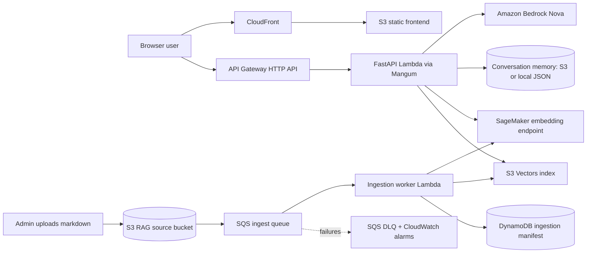
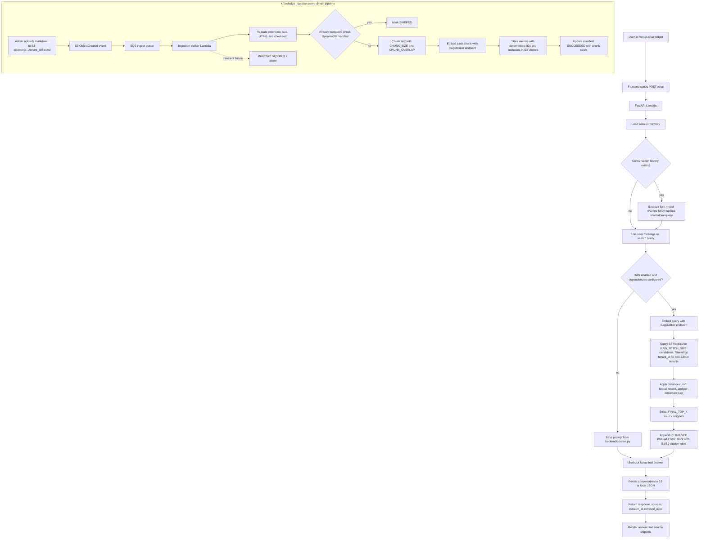

# Prop Assist Twin

Technical README for running and deploying the project.

`prop-assist-twin` is a full-stack real-estate assistant PoC built as a digital twin experience. The frontend is a static Next.js application, the backend is a FastAPI service adapted to AWS Lambda with Mangum, and the inference layer is Amazon Bedrock with Nova models. Conversation state can be stored locally during development or in S3 in AWS deployments. The backend also includes an optional SageMaker-based embedding path exposed via `/embed` and S3 Vectors-backed RAG retrieval for `/chat`. Document ingestion runs as a separate event-driven pipeline (S3 → SQS → ingestion Lambda → S3 Vectors) tracked in a DynamoDB manifest; a synchronous `/ingest` route remains available for local development only.

* * *

## Architecture


```mermaid
flowchart LR
  User[Browser user] --> CF[CloudFront]
  CF --> S3FE[S3 static frontend]
  User --> APIGW[API Gateway HTTP API]
  APIGW --> Lambda[FastAPI Lambda via Mangum]
  Lambda --> Bedrock[Amazon Bedrock Nova]
  Lambda --> Memory[(Conversation memory: S3 or local JSON)]
  Lambda --> SageMaker[SageMaker embedding endpoint]
  Lambda --> S3Vectors[S3 Vectors index]
  Admin[Admin uploads markdown] --> RagDocs[(S3 RAG source bucket)]
  RagDocs --> SQS[SQS ingest queue]
  SQS --> Worker[Ingestion worker Lambda]
  Worker --> SageMaker
  Worker --> S3Vectors
  Worker --> Manifest[(DynamoDB ingestion manifest)]
  SQS -. failures .-> DLQ[SQS DLQ + CloudWatch alarms]
```

The frontend is statically exported by Next.js and served from S3 behind CloudFront. The browser calls the API Gateway URL directly. API Gateway invokes a Python Lambda package that hosts the FastAPI app through Mangum. Document ingestion is decoupled from the chat path: uploading a markdown file to the RAG source bucket emits an S3 event onto an SQS queue, which a dedicated ingestion worker Lambda consumes to chunk, embed, and index the document while recording status in a DynamoDB manifest.

### AWS components

  * S3 (frontend bucket) serves the statically exported Next.js app.
  * CloudFront sits in front of the S3 website endpoint.
  * API Gateway HTTP API exposes the backend endpoints.
  * Lambda runs the FastAPI application through Mangum.
  * Amazon Bedrock Runtime handles inference using the configured Nova model.
  * Amazon SageMaker can optionally host a serverless embedding endpoint used by `/embed`, RAG retrieval, and the ingestion worker.
  * S3 (memory bucket) stores conversation history in deployed environments.
  * S3 Vectors can optionally store indexed markdown chunks for RAG-backed `/chat` answers.
  * S3 (RAG source bucket) receives raw markdown uploads under `incoming/`; the tenant id is derived from the markdown file's direct parent folder (for example, `incoming/Tenants/T001/file.md` -> `T001`) and emits `ObjectCreated` events.
  * SQS queue + dead-letter queue buffer ingestion events and isolate failures.
  * A second Lambda (ingestion worker) consumes the queue, validates, chunks, embeds, and indexes documents.
  * DynamoDB stores the ingestion manifest for idempotency and status tracking.
  * CloudWatch alarms watch the DLQ, worker errors, and queue age.
  * Route 53 + ACM are optional and only used when a custom domain is enabled.

---

## RAG flow


```mermaid
flowchart TD
  U[User in Next.js chat widget] --> FE[Frontend sends POST /chat]
  FE --> API[FastAPI Lambda]
  API --> MEM[Load session memory]
  MEM --> HIST{Conversation history exists?}
  HIST -- yes --> RW[Bedrock light model rewrites follow-up into standalone query]
  HIST -- no --> Q[Use user message as search query]
  RW --> Q
  Q --> RAG{RAG enabled and dependencies configured?}
  RAG -- no --> BASE[Base prompt from backend/context.py]
  RAG -- yes --> EMB[Embed query with SageMaker endpoint]
  EMB --> VEC[Query S3 Vectors for RAW_FETCH_SIZE candidates, filtered by tenant_id for non-admin tenants]
  VEC --> RERANK[Apply distance cutoff, lexical rerank, and per-document cap]
  RERANK --> SRC[Select FINAL_TOP_K source snippets]
  SRC --> BLOCK[Append RETRIEVED KNOWLEDGE block with S1/S2 citation rules]
  BASE --> ANSWER[Bedrock Nova final answer]
  BLOCK --> ANSWER
  ANSWER --> SAVE[Persist conversation to S3 or local JSON]
  SAVE --> RESP[Return response, sources, session_id, retrieval_used]
  RESP --> UI[Render answer and source snippets]

  subgraph Ingestion[Knowledge ingestion event-driven pipeline]
    MD[Admin uploads markdown to S3 incoming/.../tenant_id/file.md] --> EVT[S3 ObjectCreated event]
    EVT --> SQS[SQS ingest queue]
    SQS --> WORK[Ingestion worker Lambda]
    WORK --> SAFE[Validate extension, size, UTF-8, and checksum]
    SAFE --> IDEM{Already ingested? check DynamoDB manifest}
    IDEM -- yes --> SKIP[Mark SKIPPED]
    IDEM -- no --> CHUNK[Chunk text with CHUNK_SIZE and CHUNK_OVERLAP]
    CHUNK --> IEMB[Embed each chunk with SageMaker endpoint]
    IEMB --> PUT[Store vectors with deterministic IDs and metadata in S3 Vectors]
    PUT --> DONE[Update manifest SUCCEEDED with chunk count]
    WORK -. transient failure .-> DLQ[Retry then SQS DLQ + alarm]
  end
```

`/chat` is a grounded generation pipeline with a small query-rewrite step in front of retrieval. The backend keeps recent chat state, rewrites follow-up questions into standalone search queries when needed, retrieves candidate chunks from S3 Vectors, reranks them with distance and lexical overlap signals, caps repeated chunks from the same document, and injects the selected snippets into the model prompt as a `RETRIEVED KNOWLEDGE` block.

Retrieval is tenant-aware. Each request carries an optional `tenant_id` (defaulting to `admin`); for real tenants (`T001`, `T002`) the vector query is scoped with an S3 Vectors metadata filter (`{"tenant_id": {"$eq": ...}}`) so a session only sees its own documents, while `admin` queries across all tenants. The tenant is fixed to a session on its first turn and persisted alongside the conversation, so later turns cannot switch tenants.

The final Bedrock Nova call is instructed by `backend/context.py` to answer in the user's language, use retrieved sources for company/listing/process/policy facts, and cite only the injected `[S#]` snippets. If RAG is disabled or the embedding/vector dependencies are missing, the app falls back to normal prompt-only Bedrock chat while still preserving session memory.

## Semantic text chunking

Both the ingestion worker and the local `/ingest` endpoint use **LangChain's `RecursiveCharacterTextSplitter`** for semantic text chunking. This respects document structure before falling back to character-based splitting, ensuring better RAG retrieval quality by maintaining semantic coherence within chunks.

### Splitting hierarchy

The `RecursiveCharacterTextSplitter` applies the following hierarchy to preserve document structure:

1. **Paragraph breaks** (`\n\n`) – Sections separated by blank lines are kept together
2. **Line breaks** (`\n`) – Single newlines form natural splitting points  
3. **Word boundaries** (space) – Words are preserved, never split mid-word
4. **Characters** – Fallback character splitting for oversized chunks

### Benefits

| Aspect | Improvement |
|--------|------------|
| **Paragraph coherence** | Chunks respect paragraph boundaries |
| **Line break awareness** | Single newlines preserve document structure |
| **Word integrity** | Words are never split mid-token |
| **Context continuity** | Configurable overlap maintains context between chunks |
| **Size guarantee** | All chunks respect maximum size limits |
| **RAG quality** | More coherent chunks → better vector embeddings |
| **Battle-tested** | Uses industry-standard LangChain implementation |

### Configuration

The chunker is controlled by existing environment variables:

| Variable | Default | Purpose |
|----------|---------|---------|
| `CHUNK_SIZE` | `1500` | Target chunk size in characters |
| `CHUNK_OVERLAP` | `200` | Character overlap between consecutive chunks for context continuity |

Note: `CHUNK_OVERLAP` must be less than `CHUNK_SIZE` (LangChain validation).

### Example

For a markdown document like:

```markdown
# Property Investment Guide

This is the introduction covering market trends and opportunities.

## Residential Properties

Single-family homes are standalone structures. They offer privacy and outdoor space.

### Market Analysis

The residential market shows strong growth potential. Prices have been rising steadily.
```

The `RecursiveCharacterTextSplitter` produces chunks that:
- Keep paragraphs together when possible (separated by `\n\n`)
- Respect line boundaries (separated by `\n`)
- Preserve word boundaries (separated by spaces)
- Maintain semantic coherence for better vector embeddings

This results in more relevant RAG retrieval compared to naive character-based splitting.

* * *

## Event-driven ingestion pipeline

In deployed environments, document ingestion is fully decoupled from the chat Lambda. The chat Lambda only **reads** from S3 Vectors (`QueryVectors`/`GetVectors`); a separate ingestion worker Lambda **writes** vectors. The two Lambdas share one deployment zip but use different handlers and IAM roles.

### Flow

1. An admin uploads a markdown file to the RAG source bucket under `incoming/`, with the tenant id as the markdown file's direct parent folder (for example, `incoming/Tenants/T001/{document}.md` or `incoming/T001/{document}.md`).
2. The S3 `ObjectCreated` event (filtered to the `incoming/` prefix and `.md` suffix) is delivered to an SQS queue.
3. The ingestion worker Lambda consumes the queue (batch size 1, partial-batch failure reporting enabled) and for each document:
   - reads the object from S3 and validates extension, size, and UTF-8 content,
   - computes a SHA-256 checksum and checks the DynamoDB manifest for idempotency,
   - chunks the content, embeds each chunk via the SageMaker endpoint, and writes vectors to S3 Vectors with deterministic IDs,
   - updates the manifest status and chunk count.

### Failure handling

| Scenario | Behavior |
| --- | --- |
| Invalid file (bad extension, non-UTF-8, empty, too large) | Manifest marked `FAILED`; message acknowledged (no retry) |
| Duplicate upload (same version/checksum already `SUCCEEDED`) | Manifest marked `SKIPPED`; no re-indexing |
| Embedding or vector-write failure | Message retried via SQS; after `max_receive_count`, routed to the DLQ |
| Throttling from the serverless embedding endpoint | Absorbed by adaptive botocore retries (`EMBEDDING_MAX_ATTEMPTS`) |

### Vector IDs and metadata

Vectors use deterministic IDs of the form `{tenant_id}/{doc_id}/{source_version_or_sha256}/{chunk_index}`, so retries safely overwrite the same chunks. Each vector stores `tenant_id`, `source_bucket`, `source_key`, `source_version`, `title`, `doc_type`, `chunk_index`, `chunk_text`, `embedding_model`, and `ingested_at`.

### DynamoDB manifest

The `rag_ingestion_manifest` table (on-demand billing) tracks every ingestion attempt. Partition key is `tenant_id`; sort key is `{source_key}#{source_version_or_sha256}`. Allowed statuses are `PENDING`, `RUNNING`, `SUCCEEDED`, `FAILED`, and `SKIPPED`.

### Observability

Three CloudWatch alarms cover the pipeline: DLQ message count, worker Lambda errors, and queue age (oldest message). Set `alarm_sns_topic_arn` to receive notifications; otherwise alarms are visible in the console only.

### Local development

The synchronous `POST /ingest` endpoint still exists, but it is only registered when `LOCAL_DEV=true`. It exercises the same chunking/embedding/indexing logic in-process for quick local testing and is not exposed through API Gateway in deployed environments.

* * *

## Repository layout

```text
.
├── .github/workflows/deploy.yml      # GitHub Actions deployment pipeline
├── backend/
│   ├── common/                        # Shared, client-agnostic logic (no FastAPI)
│   │   ├── chunking.py                # Markdown-aware text splitting
│   │   ├── embeddings.py              # SageMaker embedding invocation
│   │   ├── vector_store.py            # S3 Vectors put/query helpers
│   │   ├── config.py                  # Env-driven config for the worker
│   │   └── models.py                  # Shared pydantic models (SourceItem)
│   ├── ingestion/                     # Event-driven ingestion worker Lambda
│   │   ├── worker.py                  # SQS handler with partial-batch failures
│   │   ├── ingest_document.py         # Read, validate, chunk, embed, index one doc
│   │   └── manifest.py                # DynamoDB ingestion-status access
│   ├── data/kb/                      # Markdown knowledge base for ingestion
│   │   ├── areas.md
│   │   ├── buying_process.md
│   │   ├── company_faq.md
│   │   ├── property-listings.md
│   │   └── service_areas.md
│   ├── evals/golden_chat_cases.jsonl # Golden cases for AI smoke evaluation
│   ├── tests/                        # Pytest coverage for API, retrieval, and ingestion
│   ├── context.py                    # Persona, grounding, and query rewrite prompts
│   ├── deploy.py                     # Lambda package builder (shared by both Lambdas)
│   ├── eval_chat.py                  # Chat evaluation runner
│   ├── lambda_handler.py             # Mangum Lambda entrypoint (chat)
│   ├── server.py                     # FastAPI app, RAG, chat, memory
│   ├── pyproject.toml
│   ├── requirements.txt
│   └── uv.lock
├── frontend/
│   ├── app/
│   ├── components/twin.tsx           # Browser chat UI and source rendering
│   ├── next.config.ts                # Static export configuration
│   └── package.json
├── scripts/
│   ├── deploy.sh                     # Build, Terraform apply, frontend sync
│   └── destroy.sh                    # Empty buckets and Terraform destroy
├── terraform/                        # AWS infrastructure (ingestion.tf holds the pipeline)
└── README.md
```

* * *

## Tech stack


| Layer | Technology |
| --- | --- |
| Frontend | Next.js static export, React, TypeScript, Tailwind CSS |
| Backend | Python 3.12, FastAPI, Mangum, boto3, LangChain text splitters |
| Final LLM | Amazon Bedrock Nova, default `eu.amazon.nova-pro-v1:0` |
| Query rewrite model | Amazon Bedrock Nova Micro, default `eu.amazon.nova-micro-v1:0` |
| Text chunking | LangChain `RecursiveCharacterTextSplitter` for semantic document chunking |
| Embeddings | Optional SageMaker serverless Hugging Face endpoint |
| Vector store | Optional S3 Vectors bucket and index |
| Ingestion pipeline | S3 event → SQS (+ DLQ) → ingestion worker Lambda → S3 Vectors, with DynamoDB manifest |
| Session memory | Local JSON files or S3 object storage |
| Infrastructure | Terraform, API Gateway HTTP API, Lambda, S3, CloudFront |
| CI/CD | GitHub Actions, OIDC to AWS, Terraform, uv, npm |

* * *

## Prerequisites

- AWS CLI configured for the target account.
- Terraform installed locally for manual deployment.
- Python 3.12 and `uv` for backend development.
- Node.js 20+ and npm for frontend development.
- Bedrock model access in the target AWS region.
- Optional: SageMaker + S3 Vectors enabled if you want RAG and `/ingest`.

* * *

## Local backend development

From the repository root:

```bash
cd backend
uv sync
```

Useful local environment variables:

```bash
export DEFAULT_AWS_REGION=eu-central-1
export BEDROCK_MODEL_ID=eu.amazon.nova-pro-v1:0
export BEDROCK_LIGHT_MODEL_ID=eu.amazon.nova-micro-v1:0
export CORS_ORIGINS=http://localhost:3000

# Local conversation memory
export USE_S3=false
export MEMORY_DIR=../memory

# Local admin development convenience.
# When ADMIN_API_KEY is empty and LOCAL_DEV=true, admin endpoints are allowed.
export LOCAL_DEV=true
export ADMIN_API_KEY=

# Optional RAG and ingestion dependencies
export RAG_ENABLED=true
export SAGEMAKER_ENDPOINT=
export VECTOR_BUCKET=
export VECTOR_INDEX=

# Optional RAG tuning
export RAW_FETCH_SIZE=12
export FINAL_TOP_K=3
export MAX_CHUNKS_PER_DOC=2
export MAX_CONTEXT_CHARS=1500
export MAX_RETRIEVAL_DISTANCE=
export SOURCE_SNIPPET_CHARS=280

# Semantic chunking (markdown-aware with fallback to character-based)
export CHUNK_SIZE=1500
export CHUNK_OVERLAP=200

# Request limits
export MAX_MESSAGE_CHARS=3000
export MAX_UPLOAD_BYTES=1048576
export LOG_LEVEL=INFO
```

Run the API:

```bash
uvicorn server:app --reload --port 8000
```

Backend smoke checks:

```bash
curl http://localhost:8000/health

curl -X POST http://localhost:8000/chat \
  -H 'content-type: application/json' \
  -d '{"message":"Which property would you recommend for a family?"}'
```

Admin-only endpoints require `x-api-key` when `ADMIN_API_KEY` is set:

```bash
curl -X POST http://localhost:8000/embed \
  -H 'content-type: application/json' \
  -H "x-api-key: $ADMIN_API_KEY" \
  -d '{"text":"Hello world"}'

curl -X POST http://localhost:8000/ingest \
  -H "x-api-key: $ADMIN_API_KEY" \
  -F "file=@data/kb/company_faq.md"
```

> The `/ingest` route is only available when `LOCAL_DEV=true`. In deployed
> environments, ingest documents by uploading them to the RAG source bucket
> (see [RAG knowledge ingestion](#rag-knowledge-ingestion)).

Run tests:

```bash
uv run pytest -q
```

Tests run with coverage enabled. The suite enforces a minimum coverage
threshold of 90% across `server.py`, `common/`, and `ingestion/` (configured via
`fail_under` in `backend/pyproject.toml`); `uv run pytest` fails if coverage
drops below it.

Run the golden chat evaluation against a deployed or local API:

```bash
API_BASE_URL=http://localhost:8000 uv run python eval_chat.py
```

---

## Local frontend development

```bash
cd frontend
npm ci
NEXT_PUBLIC_API_URL=http://localhost:8000 npm run dev
```

Open the local Next.js app in a browser. The chat component sends `POST /chat` requests and renders returned sources below assistant messages.

Build the static export:

```bash
NEXT_PUBLIC_API_URL=http://localhost:8000 npm run build
```

* * *

## Environment variables

### Backend Lambda / FastAPI

| Variable | Required | Default | Purpose |
| --- | --- | --- | --- |
| `DEFAULT_AWS_REGION` | yes in AWS | boto3 default | AWS region for Bedrock, SageMaker, S3, and S3 Vectors clients |
| `BEDROCK_MODEL_ID` | no | `eu.amazon.nova-pro-v1:0` | Final answer model |
| `BEDROCK_LIGHT_MODEL_ID` | no | `eu.amazon.nova-micro-v1:0` | Lightweight query rewrite model |
| `CORS_ORIGINS` | no | `*` | Comma-separated allowed browser origins |
| `USE_S3` | no | `true` | Store conversation memory in S3 when true |
| `S3_BUCKET` | when `USE_S3=true` | empty | Bucket for conversation memory |
| `MEMORY_DIR` | when `USE_S3=false` | `../memory` | Local conversation memory directory |
| `SAGEMAKER_ENDPOINT` | for `/embed`, ingestion, RAG | empty | Embedding endpoint name |
| `VECTOR_BUCKET` | for ingestion, RAG | empty | S3 Vectors bucket name |
| `VECTOR_INDEX` | for ingestion, RAG | empty | S3 Vectors index name |
| `RAG_ENABLED` | no | `true` | Enables retrieval when embedding and vector dependencies exist |
| `RAW_FETCH_SIZE` | no | `12` | Raw vector candidates fetched before reranking |
| `FINAL_TOP_K` | no | `3` | Final source chunks passed to the answer model and returned to frontend |
| `MAX_CHUNKS_PER_DOC` | no | `2` | Per-document diversity cap during retrieval |
| `MAX_CONTEXT_CHARS` | no | `1500` | Maximum retrieved context injected into final prompt |
| `MAX_RETRIEVAL_DISTANCE` | no | empty | Optional vector distance cutoff; empty disables cutoff |
| `SOURCE_SNIPPET_CHARS` | no | `280` | Maximum snippet length returned per source |
| `CHUNK_SIZE` | no | `1500` | Target chunk size in characters for semantic chunking (markdown-aware with sentence fallback) |
| `CHUNK_OVERLAP` | no | `200` | Character overlap between consecutive chunks for context continuity |
| `EMBEDDING_MAX_ATTEMPTS` | no | `10` | Max adaptive botocore retries for SageMaker `InvokeEndpoint` (absorbs serverless throttling) |
| `ADMIN_API_KEY` | for deployed admin routes | empty | Shared admin key for `/embed` and `/conversation/{session_id}` (and local `/ingest`) |
| `LOCAL_DEV` | no | `false` | Allows admin endpoints without a key when no admin key is set, and registers the local `/ingest` route |
| `MAX_MESSAGE_CHARS` | no | `3000` | Maximum incoming chat message length |
| `MAX_UPLOAD_BYTES` | no | `1048576` | Maximum markdown upload size for ingestion |
| `LOG_LEVEL` | no | `INFO` | Backend logging level |

### Ingestion worker Lambda

The ingestion worker shares the backend deployment package but is configured independently. In addition to the shared embedding/vector/chunking variables above, it uses:

| Variable | Required | Default | Purpose |
| --- | --- | --- | --- |
| `MANIFEST_TABLE` | yes | empty | DynamoDB ingestion manifest table name |
| `RAG_DOCS_BUCKET` | no | empty | S3 source bucket name (informational) |
| `EMBEDDING_MODEL` | no | `sentence-transformers/all-MiniLM-L6-v2` | Model name recorded in vector metadata |
| `INGESTION_MAX_WORKERS` | no | `4` | Per-document embedding fan-out (keep ≤ endpoint max concurrency) |
| `EMBEDDING_MAX_ATTEMPTS` | no | `10` | Adaptive retry budget for embedding throttling |

### Frontend

| Variable | Required | Purpose |
|---|---:|---|
| `NEXT_PUBLIC_API_URL` | yes | Base URL of the backend API |

* * *

## Manual AWS deployment

### 1. Bootstrap remote Terraform state

The deployment script expects an S3 bucket for Terraform state and a DynamoDB table for state locking.

```bash
export AWS_ACCOUNT_ID=$(aws sts get-caller-identity --query Account --output text)
export AWS_REGION=${DEFAULT_AWS_REGION:-eu-central-1}

aws s3api create-bucket \
  --bucket twin-terraform-state-${AWS_ACCOUNT_ID} \
  --region ${AWS_REGION} \
  --create-bucket-configuration LocationConstraint=${AWS_REGION}

aws dynamodb create-table \
  --table-name twin-terraform-locks \
  --attribute-definitions AttributeName=LockID,AttributeType=S \
  --key-schema AttributeName=LockID,KeyType=HASH \
  --billing-mode PAY_PER_REQUEST \
  --region ${AWS_REGION}
```

If the bucket or table already exists, skip that resource.

### 2. Configure Terraform variables

Edit `terraform/terraform.tfvars` for your environment. The checked-in development file currently enables SageMaker embeddings, S3 Vectors, and RAG.

Example:

```hcl
project_name = "prop-assist-twin"
environment  = "dev"

default_aws_region = "eu-central-1"
bedrock_model_id = "eu.amazon.nova-pro-v1:0"
bedrock_light_model_id = "eu.amazon.nova-micro-v1:0"

lambda_timeout = 60
api_throttle_burst_limit = 10
api_throttle_rate_limit = 5

use_custom_domain = false
root_domain = ""

sagemaker_embedding_enabled = true
sagemaker_embedding_model_name = "sentence-transformers/all-MiniLM-L6-v2"
sagemaker_embedding_image_uri = "763104351884.dkr.ecr.eu-central-1.amazonaws.com/huggingface-pytorch-inference:1.13.1-transformers4.26.0-cpu-py39-ubuntu20.04"
sagemaker_embedding_serverless_memory_mb = 3072
sagemaker_embedding_max_concurrency = 2

s3vectors_enabled = true
s3vectors_index_name = "property-kb"
s3vectors_dimension = 384
s3vectors_distance_metric = "cosine"
s3vectors_non_filterable_metadata_keys = ["chunk_text"]

rag_enabled = true
raw_fetch_size = 5
final_top_k = 3
max_chunks_per_doc = 2
max_context_chars = 1500
max_retrieval_distance = 0.35
source_snippet_chars = 200
chunk_size = 1500
chunk_overlap = 200
max_message_chars = 3000
max_upload_bytes = 1048576
log_level = "INFO"

# Event-driven ingestion pipeline
rag_ingest_enabled = true
rag_ingest_lambda_timeout = 300
rag_ingest_lambda_memory = 1024
rag_ingest_reserved_concurrency = 3
rag_ingest_max_receive_count = 5
rag_ingest_batch_size = 1
rag_ingest_queue_age_alarm_seconds = 900
alarm_sns_topic_arn = ""
ingestion_max_workers = 2
embedding_max_attempts = 10
```

Pass `admin_api_key` through `TF_VAR_admin_api_key` or a secure variable source rather than committing it to `terraform.tfvars`.

### 3. Deploy

```bash
chmod +x scripts/deploy.sh
export DEFAULT_AWS_REGION=eu-central-1
export TF_VAR_admin_api_key='change-me-to-a-real-secret'
./scripts/deploy.sh dev prop-assist-twin
```

The deployment script builds the Lambda package, initializes Terraform with the remote backend, applies infrastructure, writes `frontend/.env.production` with the deployed API URL, builds the static frontend, and syncs `frontend/out` to the frontend S3 bucket.

### 4. Destroy

```bash
chmod +x scripts/destroy.sh
export DEFAULT_AWS_REGION=eu-central-1
./scripts/destroy.sh dev prop-assist-twin
```

The destroy script empties managed frontend and memory buckets before running Terraform destroy.

---

## GitHub Actions deployment

The workflow at `.github/workflows/deploy.yml` runs on pushes to `main` and on manual dispatch. It uses GitHub OIDC to assume an AWS role, installs Python 3.12, `uv`, Terraform, Node 20, and frontend dependencies, then runs frontend lint/build, backend package build, Terraform format/validation, backend tests, and `scripts/deploy.sh`. The backend test step enforces the 90% coverage gate and fails the deployment if coverage drops below the threshold.

Required GitHub secrets:

| Secret | Purpose |
| --- | --- |
| `AWS_ROLE_ARN` | IAM role assumed by GitHub Actions through OIDC |
| `DEFAULT_AWS_REGION` | AWS region used by the workflow and deployment script |
| `ADMIN_API_KEY` | Admin key passed to Terraform as `TF_VAR_admin_api_key` |

---

## RAG knowledge ingestion

The repository includes seed markdown knowledge under `backend/data/kb`. In a deployed environment, ingest it by uploading the files to the RAG source bucket under `incoming/`, with the tenant id as the direct parent folder of each markdown file. For example, both `incoming/T001/company_faq.md` and `incoming/Tenants/T001/company_faq.md` store vectors with `tenant_id = T001`. Each upload triggers the event-driven pipeline, and you can track progress in the DynamoDB manifest table.

```bash
RAG_DOCS_BUCKET=$(terraform -chdir=terraform output -raw rag_docs_bucket)
TENANT_ID=T001

cd backend
for file in data/kb/*.md; do
  aws s3 cp "$file" "s3://${RAG_DOCS_BUCKET}/incoming/Tenants/${TENANT_ID}/$(basename "$file")"
done
```

Only markdown files uploaded under `incoming/` with a `.md` suffix trigger ingestion. The worker validates file size and UTF-8 content, deduplicates by version/checksum, and records status in the manifest. For quick local testing you can instead use the synchronous `POST /ingest` route with `LOCAL_DEV=true`.

* * *

## API endpoints

### `GET /health`

Returns service status and configuration flags for memory, embeddings, vectors, and RAG.

### `POST /chat`

Request:

```json
{
  "message": "Which properties are available in Berlin?",
  "session_id": "optional-existing-session",
  "tenant_id": "T001"
}
```

`tenant_id` is optional and defaults to `admin`. Allowed values are `T001`,
`T002`, and `admin`; any other value is rejected with `422`. Real tenants
(`T001`, `T002`) scope vector retrieval to their own documents via an S3 Vectors
metadata filter, while `admin` queries across all tenants (no filter). The
tenant is bound to the session on its first turn: once a session exists, its
stored tenant is authoritative and a differing `tenant_id` on later turns is
ignored.

Response shape:

```json
{
  "response": "...",
  "session_id": "...",
  "tenant_id": "T001",
  "sources": [
    {
      "id": "company_faq-0",
      "title": "company_faq.md",
      "source_path": "company_faq.md",
      "snippet": "...",
      "doc_type": "markdown",
      "chunk_index": 0,
      "distance": 0.18
    }
  ],
  "retrieval_used": true
}
```

### `POST /embed` admin

Embeds text using the configured SageMaker endpoint. Requires `x-api-key` when `ADMIN_API_KEY` is configured.

### `POST /ingest` admin (local only)

Accepts a markdown upload, applies semantic chunking via LangChain's `RecursiveCharacterTextSplitter` (respecting paragraph/line/word boundaries while maintaining size limits), embeds each chunk, and writes vectors plus metadata to S3 Vectors. This route is only registered when `LOCAL_DEV=true` and is intended for local development; deployed ingestion runs through the [event-driven pipeline](#event-driven-ingestion-pipeline). See [Semantic text chunking](#semantic-text-chunking) for chunking strategy details.

### `GET /conversation/{session_id}` admin

Reads stored conversation history for a session. This route exists in the FastAPI app and is protected by the same admin key, but it is not exposed as an API Gateway route in the current Terraform configuration.

* * *

## Notes and troubleshooting

- Bedrock model access must be enabled in the same region used by the Lambda.
- The default final model is `eu.amazon.nova-pro-v1:0`; the default rewrite model is `eu.amazon.nova-micro-v1:0`.
- RAG only runs when `RAG_ENABLED=true` and `SAGEMAKER_ENDPOINT`, `VECTOR_BUCKET`, and `VECTOR_INDEX` are all configured.
- `POST /chat` still works without RAG; it simply skips retrieval and answers from the base prompt plus conversation history.
- `POST /embed` and the local `POST /ingest` route will fail if no SageMaker embedding endpoint is configured.
- The event-driven ingestion pipeline and RAG retrieval require S3 Vectors configuration; the pipeline additionally requires `rag_ingest_enabled = true` (along with `s3vectors_enabled` and `sagemaker_embedding_enabled`).
- Keep `ingestion_max_workers` at or below `sagemaker_embedding_max_concurrency` to avoid self-inflicted `InvokeEndpoint` throttling; transient throttling is otherwise absorbed by `EMBEDDING_MAX_ATTEMPTS` adaptive retries.
- Ingestion failures land in the SQS DLQ. Inspect the DynamoDB manifest for the `FAILED` reason, fix the document, and either re-upload it or redrive the DLQ.
- In local development, set `LOCAL_DEV=true` with an empty `ADMIN_API_KEY` to avoid blocking yourself on admin-only routes (this also enables the local `/ingest` route).
- In deployed environments, always set a non-empty `ADMIN_API_KEY` and send it as `x-api-key` for admin routes.